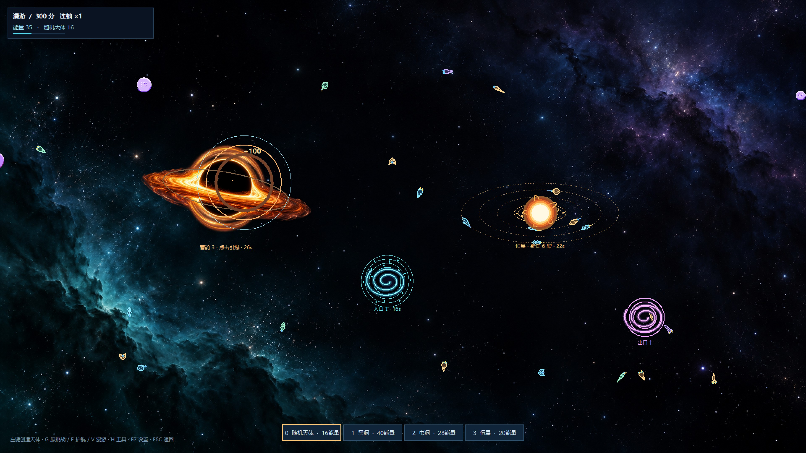
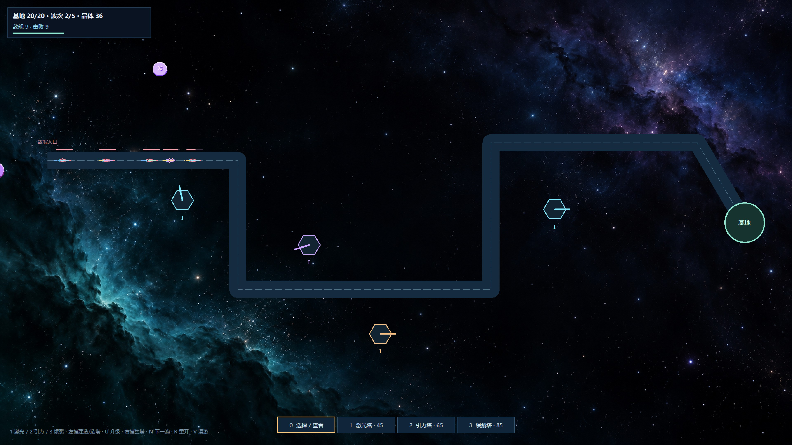

# FleetBoom · 星海漫游与舰队爆炸

A Python/Tkinter space screensaver game with gravity toys, chain explosions, escort missions, and tower defense.

FleetBoom 是一个可以安静观赏、也能随手游玩的星海桌面程序。默认进入漫游，飞船与行星缓慢漂浮；主动操作时可以引发 BOOM、布置黑洞与虫洞，或切换到护航、塔防模式。

当前主入口是 **`spaceship16.py`**，实现已经拆分到 [`fleetboom/`](fleetboom/README.md)。新版不依赖旧版单文件程序。主要面向 Windows，使用 Tkinter Canvas 绘制飞船与特效，Pillow 加载星云背景和黑洞素材。

## 四种玩法

| 模式 | 进入方式 | 目标与玩法 |
|---|---|---|
| 星海漫游 | 默认 / `V` | 不限时，观赏星海或追击飞船触发 BOOM，尝试天体组合 |
| 90 秒挑战 | `G` | 聚船、传送、蓄能引爆，争取更高分数和更长连锁 |
| 星际护航 | `E` | 90 秒内送达 12 艘金色运输船；拦截红色海盗，损失 6 艘则结束 |
| 星际塔防 | `T` | 在航道旁建塔，守住基地并击退 5 波敌舰；没有 90 秒截止 |

四种模式均可在启动界面或 `F2` 设置面板选择。切换模式会开始新一局，难度、速度和尺寸设置继续保留。

## 新版运行截图

天体互动与 BOOM：



星际塔防：



以上为当前 Python 版的实际运行画面；为展示操作，截图固定显示了底边工具条。

## 快速运行

推荐 **Windows 10/11 + Python 3.10 或更新版本**。本次验证环境为 Python 3.12.9、Pillow 12.0.0。

在 PowerShell 中执行：

```powershell
git clone https://github.com/danny0559/fleetboom.git
Set-Location fleetboom
python -m venv .venv
& '.\.venv\Scripts\python.exe' -m pip install -r requirements.txt
& '.\.venv\Scripts\python.exe' '.\spaceship16.py'
```

也可以按模块启动：

```powershell
& '.\.venv\Scripts\python.exe' -m fleetboom
```

Tkinter 随常见的 Windows Python 安装提供。`assets/` 中的两张 PNG 是运行所需素材，请与源码一起保留。新环境需要安装 Pillow；Tkinter 不通过 `pip install tkinter` 安装。

当前更新的是 **Python 源码**，没有重新构建 EXE。旧版可执行文件不能代表当前四模式版本。

## 操作

| 操作 | 功能 |
|---|---|
| `V` / `G` / `E` / `T` | 漫游 / 计分挑战 / 护航 / 塔防 |
| `F2` | 打开或收起灰黑色实时设置面板 |
| `H` | 固定或收起画面上的信息与工具条 |
| `P` | 暂停 / 继续 |
| `R` | 重开当前模式 |
| `ESC` | 结束当前场景并返回启动设置 |

设置面板默认隐藏；鼠标移到屏幕底部可以唤出工具条。漫游停止操作 4 秒后信息卡隐藏，初始提示 6 秒后收起。鼠标静止超过 1.5 秒时，漫游中漂过指针的飞船不会自动爆炸。

### 漫游、挑战与护航

- 鼠标追上飞船触发 **BOOM**；冲击波可引爆邻近飞船，形成连锁。护航中鼠标只追击海盗，运输船会受海盗、黑洞和冲击波伤害。
- `0` 随机天体，`1` 黑洞，`2` 虫洞，`3` 恒星；左键放置，也可在底边工具条选择。
- **黑洞**螺旋吞噬附近飞船。每吞噬一艘，目标尺寸增加初始尺寸的 6%，平滑成长，最高 2 倍；吸引范围与吞噬核心一起扩大。再次点击核心引爆蓄能冲击波。
- **虫洞**分两次放置：先选蓝色入口，再选紫色出口，两端至少相距 140 像素。单向传送，出口不会反向吸引；完成后才扣能量。
- **恒星**把飞船聚集到三条横向椭圆轨道，聚集越多，轨道与光晕越亮。
- 右键或 `C` 清场；正在放虫洞时，右键只取消未完成的放置。透明桌面背景的空白位置可按空格放置天体。

组合示例：恒星聚船 → 虫洞把轨道上的飞船送到黑洞 → 黑洞吞噬成长 → 点击核心引爆。护航中可以把虫洞出口放到灯塔附近，快速送达运输船，但要避免把金色运输船送进黑洞或爆炸范围。

挑战与漫游初始能量 70，护航初始能量 100，上限均为 100。随机天体 / 黑洞 / 虫洞 / 恒星费用分别为 16 / 40 / 28 / 20。击败回能，能量也会缓慢恢复。护航每次送达奖励 250 分和 12 能量。

### 星际塔防

基地初始生命 **20**，初始晶体 **160**。普通敌舰漏过扣 1 点生命，重型敌舰扣 3 点；生命归零失败，击退全部五波获胜。

| 选择 | 防御塔 | 费用 | 特点 |
|---|---|---|---|
| `1` | 激光塔 | 45 晶体 | 快速攻击航线上最靠前的敌舰 |
| `2` | 引力塔 | 65 晶体 | 范围减速与少量伤害，配合攻击塔 |
| `3` | 爆裂塔 | 85 晶体 | 较慢的范围攻击，拦截密集舰群 |

- 左键空地建塔，左键已有塔选中并显示射程；不能占用航线或与其他塔重叠。
- 选塔后按 `U` 升级，最高三级，升级费用分别 35、70 晶体。
- 右键点击塔出售，返还累计投入的 70%；右键空地或 `C` 取消选择，`0` 切到查看模式。
- 第一波前有 12 秒准备时间，波次之间有 8 秒；`N` 或空格提前开始下一波。
- 击败敌舰获得晶体，每波清空额外获得 25 晶体。塔防使用独立的敌舰、资源和伤害规则，原天体玩法在其他模式中保留。

## 难度、速度与外观设置

启动界面和 `F2` 面板都提供实时参数：

- 基础难度 **Lv.1～11**，可关闭自动升级以保持所选等级。
- 自动升级阈值，默认每击败 **10 艘**升一级。漫游与护航按击败数升级，计分挑战叠加挑战阶段，塔防按波次升级。
- 飞船速度 **0.25～3.0 倍**，影响普通飞船、天体中的飞船移动、护航舰船和塔防敌舰；倒计时、能量恢复、天体寿命和塔的射速保持原计时规则。
- 飞船与行星尺寸 **0.3～2.5 倍**、透明桌面背景。

设置在重开和模式切换后保留；难度、速度与自动升级配置也保留到返回启动设置后。塔防实时修改难度会调整敌舰速度与血量，并保留已受伤的比例。小屏幕可滚动查看设置面板。

## 模块结构

```text
fleetboom/
├── spaceship16.py              # 新版启动入口，兼容原有公开类名
├── fleetboom/                  # 模块化实现
│   ├── ui.py                   # 启动设置、实时控制面板
│   ├── settings.py             # 共享难度与速度设置
│   ├── controller.py           # 漫游、挑战与主循环
│   ├── escort.py               # 独立护航模式
│   ├── tower_defense.py        # 独立塔防绘制与操作
│   ├── td_rules.py             # 无窗口依赖的塔防模拟
│   ├── rules.py                # 计分、能量、计时
│   ├── abilities.py            # 天体放置、取消与虫洞预览
│   ├── physics.py              # 引力、公转、单向传送
│   ├── combat.py               # BOOM、连锁与蓄能引爆
│   ├── ships.py / projectiles.py
│   ├── celestials.py / planets.py
│   └── hud.py / world.py / assets.py
├── assets/                     # 黑洞与星云背景，附素材生成说明
├── verify_*.py                 # 规则与真实 Tk Canvas 验证
├── spaceship14.py / spaceship15.py  # 本地旧版源码快照
├── requirements.txt
├── docs/                       # 截图
└── LICENSE
```

改虫洞方向看 `physics.py`，改美术看 `ships.py` / `celestials.py`，改界面看 `ui.py` / `hud.py`。详细职责见 [模块修改指南](fleetboom/README.md)。

## 验证

在可创建 Tk 窗口的桌面环境中运行：

```powershell
& '.\.venv\Scripts\python.exe' '.\verify_challenge.py'
& '.\.venv\Scripts\python.exe' '.\verify_escort.py'
& '.\.venv\Scripts\python.exe' '.\verify_tower_defense.py'
& '.\.venv\Scripts\python.exe' '.\verify_settings.py'
```

检查覆盖能量、连锁、虫洞方向、黑洞成长、护航送达与损失、塔防经济与胜负、实时设置及模式切换。验证脚本会短暂创建全屏窗口，Tk 集成检查需要图形桌面。

旧版 `spaceship15.py` 提供关闭 BOOM 和子弹的观赏模式，其验证脚本为 `verify_gravity.py`。Git 历史与 `v1.0` 标签保留最初版本；`docs/` 中原有截图属于旧版。

## License

作者：[danny0559](https://github.com/danny0559)。代码沿用仓库的 [MIT License](LICENSE)。黑洞与星云图片的生成说明见 [assets/PROMPTS.md](assets/PROMPTS.md)。
